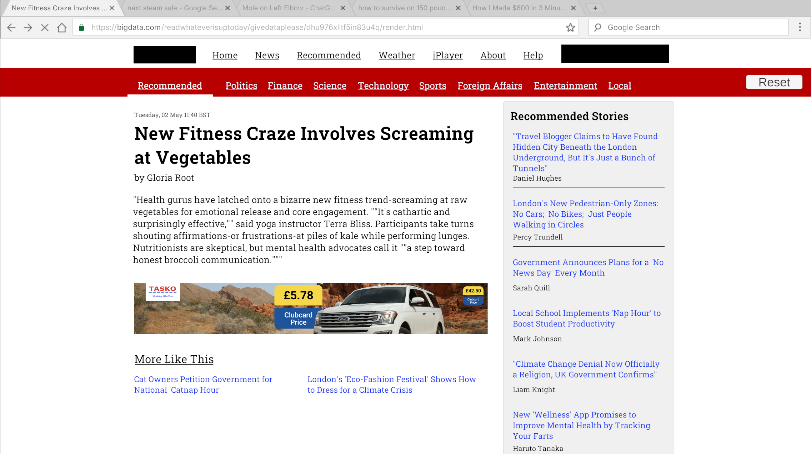
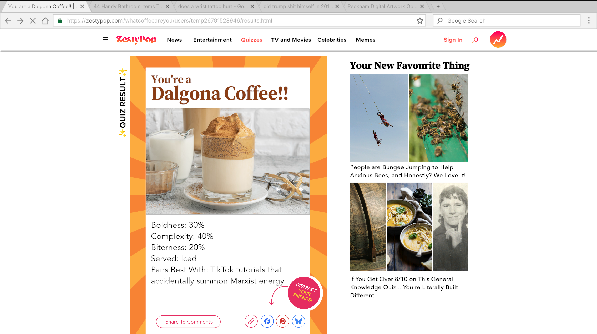
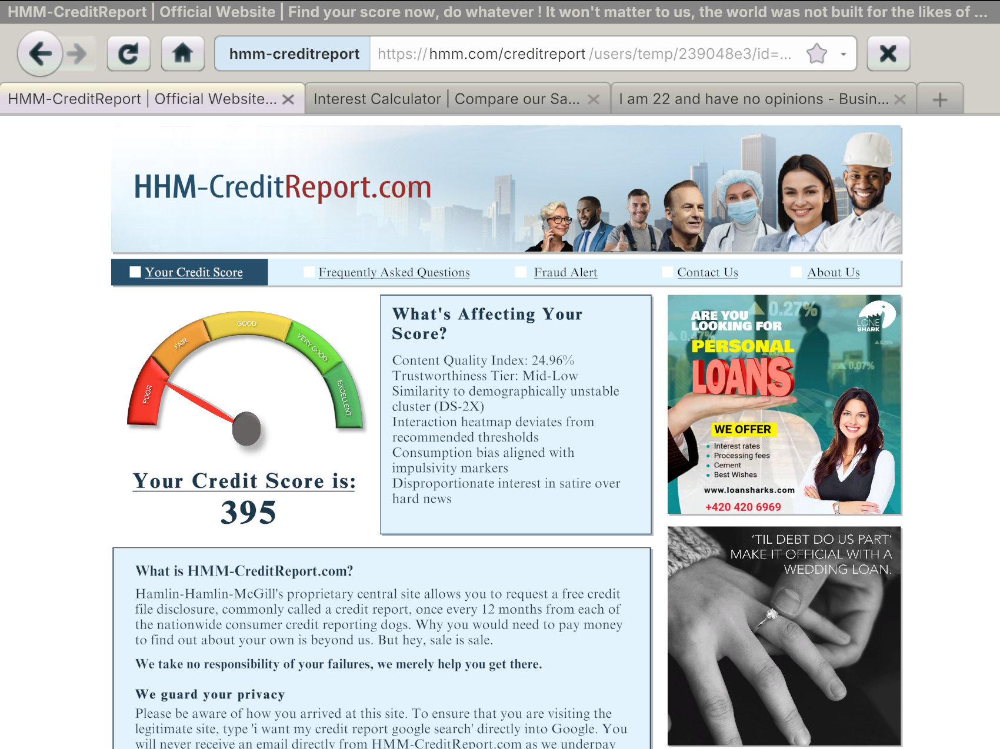

# Cookies!

 ### Artist Statement
Are we the same people off and on the internet? What invisible trails do we leave behind? And who follows them? Most importantly, what do they make of it?

*Cookies!*, an interactive artwork built with Unity and driven by obsessive research into algorithmic profiling, is my meditation on Cathy O'Neil's brilliant 'Weapons of Math Destruction'. Drawing from her time behind the curtain, O'Neil presents evidence highlighting how, in the absence of full context, algorithms construct digital proxies - reductive models that place us into predictive "buckets", with impacts that go beyond the trivial. These systems don't understand us, they sort us. 

*Cookies!* invites the audience to explore this through a (simulated) news website, clicking through stories that interest them. In the background, an algorithm tracks every click to create an (intentionally, impossibly myopic) profile that is then used to recommend more stories, tailor ads, and create two juxtaposed outcomes - a playful "What Coffee Are You?", and a (hopefully unnerving) prediction of your Credit Score. Both come from the same limited dataset - highlighting how casual clicks create data-driven destiny, based on the inherent biases of the systems' creators.

It's fun. Until it isn't.

---
### Project Description
*Cookies!* is be presented as three screens - an interactive screen containing a BBC-styled news website, and two automatically-updated screens reflecting (a) The result of a Buzzfeed-styled "What Coffee Are You?" quiz; and (b) A financial portal that shows a predictive 'credit score' with intentionally vague reasoning.

On Screen 1, the audience is invited (through the UI) to first "Accept Cookies" to start the simulation. Hereafter audience members can engage with the satirical news articles and click through the recommended articles to keep browsing the site.

The two other screens will update their content automatically after each click, quickly establishing a feedback loop, as the audience members explore in real time how their choice of news stories to read feeds into the invisible algorithm - changing the assumptions it makes about them, and the pages' content.

Finally, audience members will be able to reset the simulation with a big red button for the next person to play with.

---

### Gallery

> **[Click here for Video Demo on YouTube](https://youtu.be/WbZiwbL7sB0)**

> Screen 1, the News Website. This is one of the instances of the page, attached here in highest resolution at 1920 x 1080

   

> Screen 2, the "What Coffee Are You?" quiz. This is one of the instances of the page, attached here in highest resolution at 1920 x 1080

   

> Screen 3, the Credit Report Website. This is one of the instances of the page, attached here in highest resolution at 1152 x 864 (Classic 4:3)

   

---